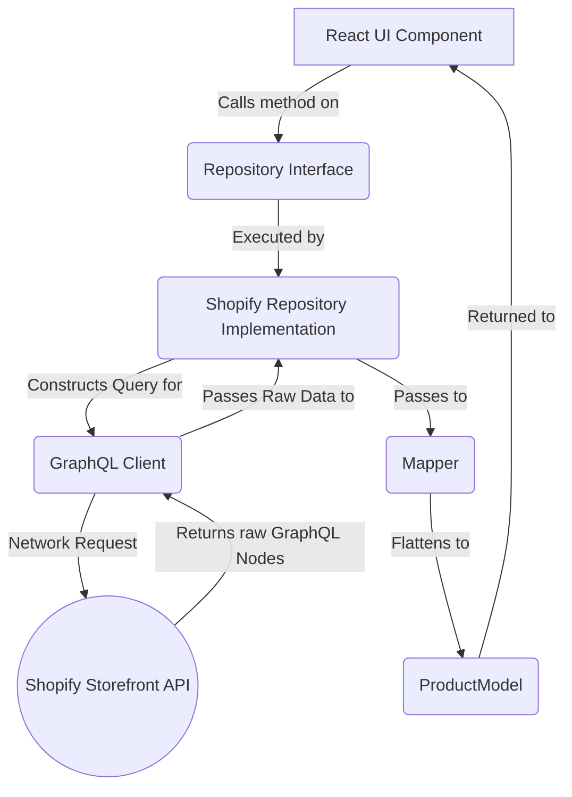

# SmartCart Architecture

## Project Overview

SmartCart is a premium, highly-optimized headless Shopify storefront designed to deliver lightning-fast performance, incredible aesthetics, and modern dynamic user experiences. 

**Tech Stack:**
- **Framework**: Next.js (App Router)
- **Language**: TypeScript
- **Styling**: Vanilla CSS Modules
- **Animations**: Framer Motion
- **State Management**: Zustand
- **Backend API**: Shopify Storefront API (GraphQL)

**Design Philosophy:**
SmartCart strictly decouples UI rendering from data fetching. It adheres to a clean Architecture pattern, ensuring that React components never directly communicate with the Shopify Storefront API. Instead, they interact with abstract Repositories which supply normalized `Models`.

**Headless Shopify Architecture:**
By leveraging Next.js React Server Components (RSC) and Shopify's Storefront API, the application prerenders crucial eCommerce paths (Homepage, Collections, PDPs) statically or dynamically with robust caching strategies, while highly interactive user features (Cart, Wishlist, Recently Viewed) hydrate instantly on the client.

---

## Folder Structure

- **`src/app`**: Contains all Next.js App Router definitions. Every directory here correlates directly to a URL path (e.g., `src/app/products/[slug]`). It holds Server Components, layouts, and global CSS.
- **`src/components`**: Contains all modular React components. They are grouped by feature area (`cart`, `collection`, `home`, `product`, `ui`).
- **`src/commerce`**: The absolute core of the data architecture. It completely abstracts Shopify away from the UI. It houses models, mappers, repositories, the GraphQL client, and error handling.
- **`src/store`**: Contains all client-side global state logic powered by Zustand (e.g., Wishlist, Cart, Recently Viewed). 
- **`src/hooks`**: Custom React hooks (e.g., `useRecentSearches`, `useScrollPosition`).
- **`src/lib`**: Utility functions, constants, formatting tools, and helper logic shared globally.
- **`src/services`**: (Legacy/Transitional) Contains earlier iterations of the cart and authentication services, paving the way for full integration into the `commerce` core.
- **`src/styles`**: Contains global tokens, CSS resets, and design system variables (`globals.css`, `tokens.css`).

---

## Commerce Layer

The `src/commerce` layer sits between the UI and Shopify. 

1. **GraphQL Client** (`src/commerce/client/shopifyClient.ts`): An isomorphic `fetch` wrapper designed to query Shopify. It handles timeouts, rate limits (429s), robust retries, and Maps GraphQL errors to domain-specific errors.
2. **Repositories** (`src/commerce/repositories`): Classes that fetch raw data from the GraphQL client. They are responsible for supplying data to the app. 
3. **Repository Interfaces**: Abstract definitions (e.g. `ProductRepository`) ensuring that the UI can theoretically be decoupled from Shopify entirely.
4. **Mappers** (`src/commerce/mappers`): Functions that take the deeply nested Shopify GraphQL graph (nodes/edges) and flatten them into clean, predictable TypeScript objects.
5. **Models** (`src/commerce/models`): TypeScript interfaces describing the normalized objects (e.g., `ProductModel`, `CollectionModel`).
6. **Providers**: Dependency Injection contexts allowing repositories to be swapped or mocked out for testing.
7. **Error Layer** (`src/commerce/errors`): Custom Error classes (`NetworkError`, `ProductNotFoundError`) to allow the UI to handle failures gracefully (e.g. returning a `notFound()` Next.js page).
8. **Logger**: Internal telemetry for GraphQL request durations, retry attempts, and failures.
9. **Environment Validation**: Eager validation script (`src/commerce/utils/env.ts`) that asserts all required Shopify credentials exist at boot.
10. **Configuration**: Hardcoded retry thresholds, caching logic, and API version constants.

---

## Data Flow

Data exclusively flows through the application in a strict, single-direction path. UI components only know about Models.

---

## Rendering Strategy

- **React Server Components (RSC)**: All primary pages (Home, Collection lists, Product Details) are RSCs. They perform zero-bundle-size data fetching via the Commerce Layer and stream HTML to the browser.
- **Client Components**: Any component utilizing `useState`, `useEffect`, `useCartStore`, or framer-motion is strictly marked `"use client"`. They are hydrated independently.
- **Server-Side Data Fetching**: Repositories leverage the native Next.js extended `fetch` API for deduplication and caching. 
- **Caching & Revalidation**: 
  - `Homepage` queries: 5 minutes cache (`revalidate: 300`)
  - `Product Details`: 10 minutes cache (`revalidate: 600`)
- **Hydration Boundaries**: Client components are kept as low in the component tree as possible (e.g., `ProductClientView` handles interaction, while the parent `page.tsx` handles SEO and data fetching).

---

## State Management

Global state is entirely managed by **Zustand** stores in `src/store`.

- **Wishlist** (`useWishlistStore.ts`): Stores only `product.handle` strings. Persists to `localStorage`. Exists to track user favorites across sessions.
- **Recently Viewed** (`useRecentlyViewedStore.ts`): Stores only `product.handle` strings (max 10). Persists to `localStorage`. Exists to track the user's browsing journey.
- **Cart** (`useCartStore.ts`): Currently tracks Cart lines, totals, and UI Drawer toggles. **MOCK – Pending Shopify Integration**.
- **Authentication**: Stores UI login states. **MOCK – Pending Shopify Integration**.
- **Search**: (In Hooks) Tracks recent search strings.

*Note: Stores only persist IDs/Handles. Upon hydration, client components fetch the fresh `ProductModel`s from the repository.*

---

## Routing

- **Homepage** (`/`): Shows live Best Sellers and Collections. 
- **Collections** (`/collections/[slug]`): Renders products filtered by a live Shopify Collection. 
- **Product Pages** (`/products/[slug]`): Fetches a live `ProductModel` by handle. Uses `notFound()` if Shopify throws a `ProductNotFoundError`.
- **Wishlist** (`/wishlist`): Client-hydrated page reading from `useWishlistStore`.
- **Cart**: Handled exclusively via a global drawer overlay. 
- **Account** (`/account/*`): **MOCK – Pending Shopify Integration**. 
- **Search**: Rendered in a globally accessible overlay. **MOCK – Pending Shopify Integration**. 

---

## Current Shopify Integrations

- **Products**: Fully live (Images, prices, variants, options).
- **Collections**: Fully live.
- **Routing**: 100% of product routing dynamically relies on `ProductModel.handle`.
- **Recommendations**: Integrates Shopify Product Recommendations API, cascading to Best Sellers if none are found.
- **SEO Metadata**: Product titles and descriptions natively populate `<title>` and `<meta>` tags.
- **Image Optimization**: Shopify CDN domains (`cdn.shopify.com`) are configured in `next.config.ts` for Next.js `next/image` optimization.
- **Caching**: Full integration with Next.js ISR (Incremental Static Regeneration).

---

## Remaining Integrations

- **Cart API**: Move cart from local mock logic to actual Shopify Storefront Cart Mutations (`cartCreate`, `cartLinesAdd`).
- **Predictive Search**: Move from mock strings to the Shopify Predictive Search endpoint.
- **Customer API**: Integrate `customerAccessTokenCreate` and account retrieval.
- **Checkout**: Integrate the Shopify checkout URL generation and redirect.
- **Analytics**: Telemetry and purchase tracking.
- **Deployment**: Vercel CI/CD setup.
